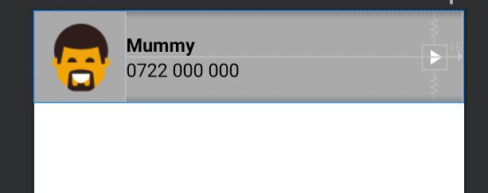

# Contact-List-App-Demo

understanding how classes and Adapters work using Contacts list application simulator.

Working with Media Player in Android

Also dealing with Life cycle in Android 

### Layout images:

__General List layout__:

__List view __:

  Listview layout                 |  Layout with images 
:--------------------------------:|:-------------------------:
  |  

__Layout without images__:

