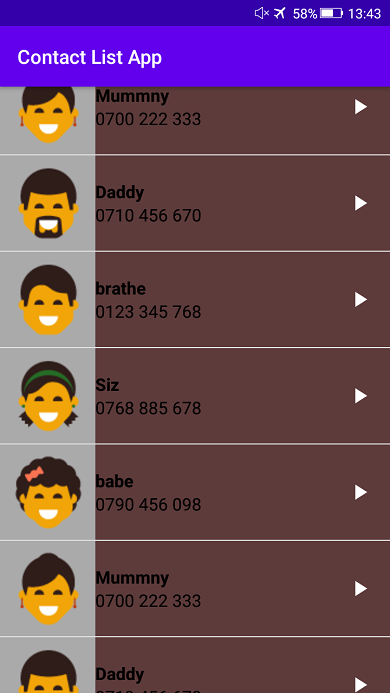
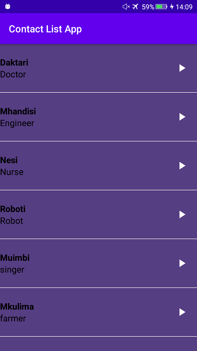
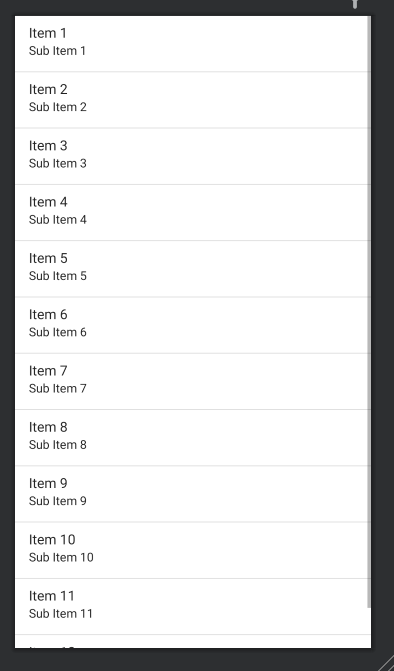

# Contact-List-App-Demo Android Meet-up

understanding how classes and Adapters work using Contacts list application simulator.

Working with Media Player in Android

Also dealing with Life cycle in Android 

Learn about invoking Adapters with Lists

Get to understand Multiple constructors.

### Layout images:

__General List layout__:

__List view __:

Listview layout with images           |      Layout with no images 
:--------------------------------:    |    :-------------------------:
      |      

__List Item Layout__:

